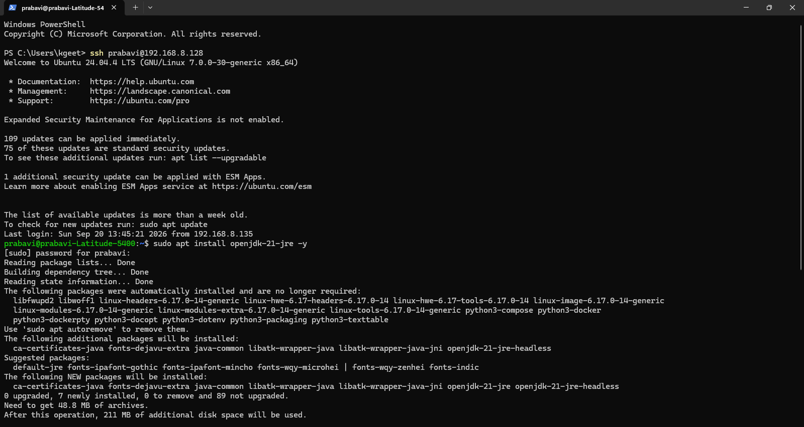
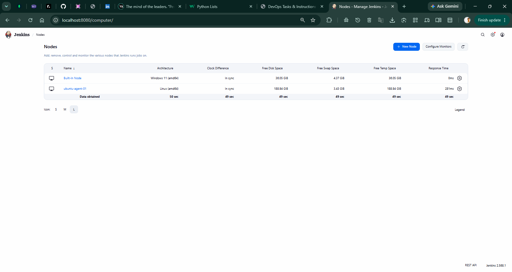
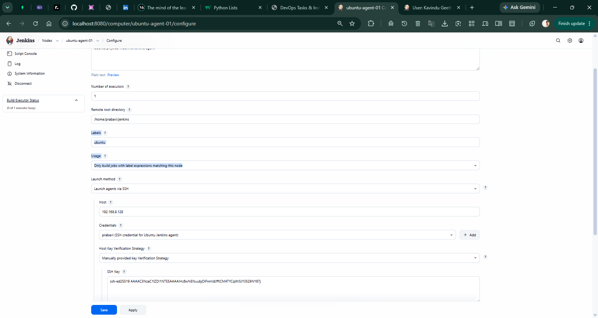
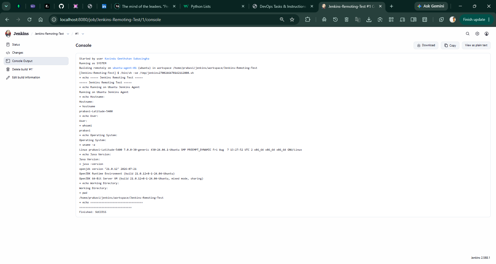
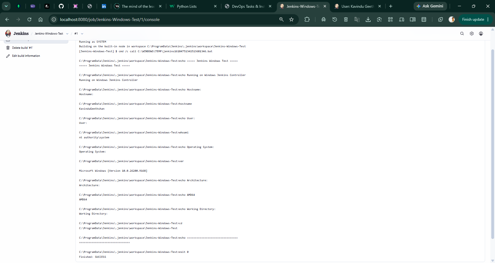

# Jenkins Remoting Project

A hands-on DevOps infrastructure project demonstrating Jenkins Remoting across physical heterogenous operating systems. This project connects a Windows-hosted Jenkins Controller to a dedicated physical Ubuntu Linux Agent over SSH, executes builds remotely, validates build distribution, and implements strict node isolation using Jenkins labels and access policies.

---

## Project Overview

In an enterprise CI/CD ecosystem, executing build and deployment workloads directly on the Jenkins Controller poses security, scalability, and performance bottlenecks. Jenkins Remoting addresses this by delegating execution to distributed agent nodes.

This project implements and validates a dual-node Jenkins architecture:
- **Jenkins Controller & Built-In Node:** Installed and managed on a Windows host, responsible for orchestration, credential management, plugin administration, and job scheduling.
- **Jenkins Remote Agent:** Configured on a separate physical Ubuntu Linux laptop, operating as a dedicated permanent agent.
- **SSH-Based Connectivity:** Established an encrypted SSH transport channel managed with Jenkins credentials and host key verification for secure controller-to-agent communication.
- **Node Isolation:** Configured dedicated node labeling (`ubuntu`) paired with the `Only build jobs with label expressions matching this node` usage policy to ensure precise workload placement and prevent arbitrary execution.
- **Remote Job Execution:** Successfully triggered and ran execution jobs on the remote Ubuntu node with execution logs verified in the console.
- **Build Distribution:** Dispatched independent workloads across both the Windows Built-In Node and the Ubuntu Agent to prove distributed scheduling capabilities.

---

## Architecture

The deployment architecture consists of two physical host machines communicating over an encrypted local SSH network interface:

```text
+-------------------------------------------------------------+
|                 Windows Personal Laptop                     |
|                                                             |
|   +-----------------------------------------------------+   |
|   |                  Jenkins Controller                 |   |
|   |      - Pipeline Orchestration & Web UI              |   |
|   |      - Credential Store & Key Management            |   |
|   |      - Plugin Ecosystem                             |   |
|   +-----------------------------------------------------+   |
|   |                  Built-In Node                      |   |
|   |      - Windows Native Workloads (AMD64)             |   |
|   +-----------------------------------------------------+   |
+------------------------------+------------------------------+
                               |
                               |  SSH Connection
                               |  (Port 22 / Key Verification)
                               |
+------------------------------v------------------------------+
|                   Ubuntu Linux Laptop                       |
|                                                             |
|   +-----------------------------------------------------+   |
|   |             Jenkins Remote Agent                    |   |
|   |      - Node Name: ubuntu-agent-01                   |   |
|   |      - Label: ubuntu                                |   |
|   |      - Remote Root: /home/prabavi/jenkins           |   |
|   |      - Linux Native Workloads (x86_64)              |   |
|   +-----------------------------------------------------+   |
+-------------------------------------------------------------+
```

### Machine Roles
- **Windows Laptop (Controller / Built-In Node):** Serves as the central control plane, hosting the Jenkins web UI, orchestrating pipelines, and executing local Windows-targeted jobs when explicitly required.
- **Ubuntu Linux Laptop (Remote Agent):** Acts as the remote worker node, receiving task payloads dispatched over SSH from the controller and executing them within an isolated Linux workspace directory.

---

## Environment

| Component | Environment Details |
|---|---|
| Jenkins Controller | Windows |
| Built-In Node | Windows |
| Remote Jenkins Agent | Ubuntu Linux |
| Agent Name | `ubuntu-agent-01` |
| Agent Label | `ubuntu` |
| Remote Root Directory | `/home/prabavi/jenkins` |
| Agent Connection Protocol | SSH |
| Ubuntu OS & Architecture | Ubuntu 24.04.4 LTS (x86_64) |
| Windows OS & Architecture | Microsoft Windows 11 (AMD64) |
| Controller Java Runtime | OpenJDK 21 |
| Agent Java Runtime | OpenJDK 21 |

> [!NOTE]
> Both host machines share the x86-64 instruction set architecture (designated as AMD64 on Windows and x86_64 on Linux), demonstrating cross-platform workload distribution across Windows and Linux environments without emulation layers.

---

## Jenkins Controller Setup

The Jenkins Controller was deployed on the Windows host environment, configuring the administrative control plane and core runtime dependencies.


*Figure 1: Jenkins Controller successfully installed, configured, and accessible via the web interface on the Windows host.*

Following installation, the initial setup wizard was completed to install standard and recommended Jenkins plugins—including the **SSH Build Agents** and **Credentials Binding** plugins required to facilitate secure remote agent connectivity.


*Figure 2: Installation of standard and recommended Jenkins plugins supplying core agent remoting and credential management capabilities.*

---

## SSH Connectivity

Secure Shell (SSH) provides the transport protocol for Jenkins Remoting, allowing the controller to launch and manage the remoting agent process on the remote machine securely.


*Figure 3: Secure SSH connection established from Windows PowerShell to the Ubuntu laptop (`prabavi@192.168.8.128`) and preparation of the OpenJDK 21 runtime.*

Establishing direct SSH communication verified network reachability, user authentication, and environment prerequisites prior to configuring the node inside Jenkins.

---

## Ubuntu Agent Setup

To register the Ubuntu machine as a dedicated execution node, an agent record was initialized in the Jenkins Node Management console.


*Figure 4: Intermediate setup stage initiating the creation of `ubuntu-agent-01` as a permanent agent in the Jenkins management console.*

The agent configuration was finalized with the remote root directory set to `/home/prabavi/jenkins`, launch method configured to SSH, and credentials bound to the user profile. Once launched, Jenkins verified the node and brought it online.


*Figure 5: Node overview verifying both the Windows Built-In Node and the Ubuntu Agent (`ubuntu-agent-01`) online, synchronized, and monitored.*

---

## Node Isolation

Node isolation ensures that jobs are executed only on appropriate, intended machines and prevents arbitrary builds from occupying dedicated worker nodes.


*Figure 6: Node configuration showing the `ubuntu` label assignment, restricted usage policy, and SSH host key verification.*

### Isolation Settings Implemented
- **Node Label:** `ubuntu`
- **Usage Policy:** `Only build jobs with label expressions matching this node`
- **Launch Method:** Launch agents via SSH (`192.168.8.128`) with stored SSH credentials and manual host key verification.

Under this configuration, Jenkins will refuse to schedule any workload on `ubuntu-agent-01` unless the job explicitly targets the `ubuntu` label expression.

---

## Remote Jenkins Job Execution

To validate the remoting configuration, a test build was triggered targeting the `ubuntu` label.


*Figure 7: Build console output verifying remote execution on `ubuntu-agent-01` within the Ubuntu environment.*

### Evidence of Remote Execution
The console output confirms execution took place entirely on the remote Ubuntu laptop:
- **Remote Dispatch:** `Building remotely on ubuntu-agent-01 (ubuntu)`
- **Remote Workspace:** `/home/prabavi/jenkins/workspace/Jenkins-Remoting-Test`
- **Remote Hostname:** `prabavi-Latitude-5400`
- **Remote Operating System:** `Linux prabavi-Latitude-5400 ... x86_64 GNU/Linux`
- **Remote User Context:** `prabavi`
- **Remote Java Environment:** `openjdk version "21.0.12"`
- **Execution Status:** `Finished: SUCCESS`

---

## Build Distribution Across Machines

The Jenkins infrastructure was verified for distributed execution by dispatching distinct workloads to both the Windows Built-In Node and the remote Ubuntu Agent.

### Windows Built-In Node Execution
A build configured for the Windows environment ran directly on the controller's built-in node, confirming that the control plane continues to support local tasks when designated.


*Figure 8: Windows build console output confirming execution on the built-in node under Windows 11 (AMD64).*

### Execution Comparison

| Host Machine | Execution Location | Target OS | Architecture | Status |
|---|---|---|---|---|
| Windows Laptop | Built-In Node | Windows 11 | AMD64 (x86-64) | SUCCESS |
| Ubuntu Laptop | `ubuntu-agent-01` | Ubuntu 24.04 LTS | x86_64 | SUCCESS |

This confirms that the Jenkins instance successfully partitions and routes builds across distinct operating systems according to configuration.

---

## Task 2 Requirements Coverage

| Requirement | Project Implementation & Evidence |
|---|---|
| Set up Jenkins Remoting to connect remote Jenkins nodes | Configured permanent node `ubuntu-agent-01` over SSH transport with OpenJDK 21 |
| Distribute build loads across different machines securely | Dispatched and executed separate jobs on Windows Built-In Node and Ubuntu Agent |
| Run jobs on various architectures remotely | Successfully executed jobs in Windows (AMD64) and Linux (x86_64) environments |
| Improve security using node isolation | Applied `ubuntu` label and enforced `Only build jobs with label expressions matching this node` |
| Gain hands-on experience with Jenkins remote execution | Verified remote console outputs, remote workspace directories, and system telemetry |

---

## Skills Demonstrated

- **Jenkins Controller Administration:** Installation, configuration, and management of Jenkins on Windows.
- **Jenkins Remoting & Agent Management:** Establishing and monitoring permanent SSH-based agent nodes.
- **Secure Transport & Credential Management:** Managing Jenkins SSH credentials and configuring SSH host key verification strategies.
- **Node Isolation & Workload Placement:** Restricting node usage with label expressions to prevent unintended execution.
- **Cross-Platform DevOps Administration:** Configuring prerequisites, directory permissions, and Java environments on both Windows and Linux hosts.
- **Distributed Build Orchestration:** Distributing and validating workloads across multiple physical machines.
- **Infrastructure Verification:** Inspecting console logs, workspace allocations, and runtime parameters to validate infrastructure behavior.

---

## Project Outcome

This project demonstrated the end-to-end setup and validation of Jenkins Remoting across physical heterogenous hosts. By establishing an SSH connection between a Windows Jenkins Controller and a physical Ubuntu Linux Agent, builds were successfully distributed, executed remotely, and isolated using Jenkins node labels and restricted usage policies.

---

## Evidence Gallery

| Screenshot | Description |
|---|---|
|  | Secure SSH connectivity from Windows to the Ubuntu laptop and OpenJDK 21 environment configuration. |
|  | Jenkins Controller successfully installed and ready on the Windows host. |
|  | Initial plugin installation stage provisioning SSH agent and credentials tooling. |
|  | Intermediate stage creating the `ubuntu-agent-01` permanent agent node. |
|  | Jenkins node management view showing both the Built-In Node and Ubuntu Agent online and healthy. |
|  | Node configuration demonstrating label assignment, restricted usage, and SSH launch configuration. |
|  | Remote build execution log on `ubuntu-agent-01` proving execution on Linux. |
|  | Build console log verifying execution on the Windows Built-In Node. |

---

## Author

**Kavindu Geethshan**  
Bachelor of Information Technology (BIT)  
University of Colombo School of Computing  

- **GitHub:** [kavindugeethshan](https://github.com/kavindugeethshan)

---

## License

This project is developed for educational and portfolio purposes.
